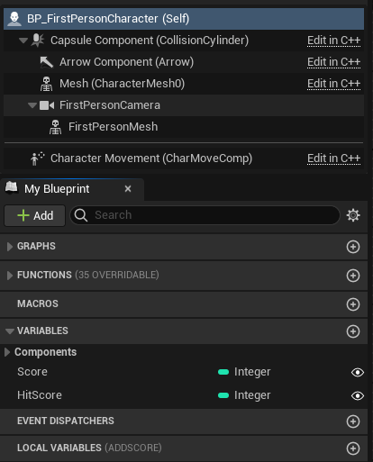
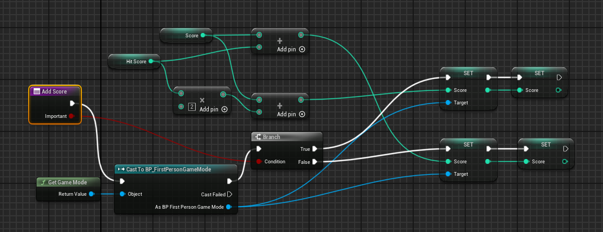
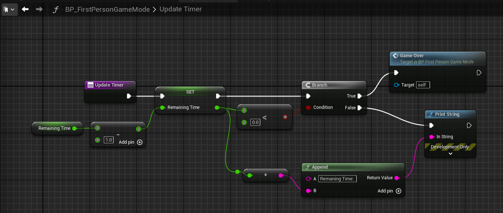
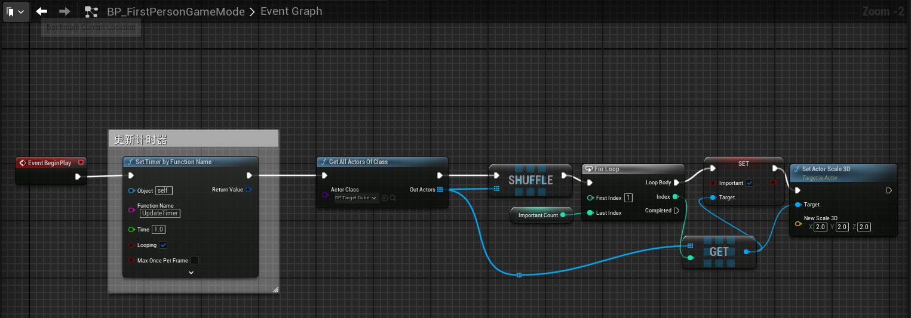
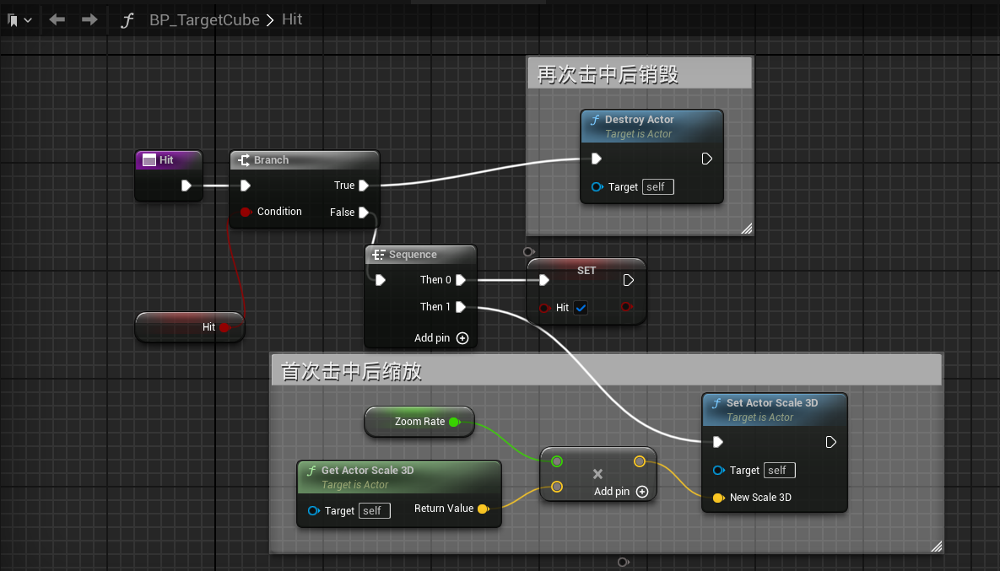
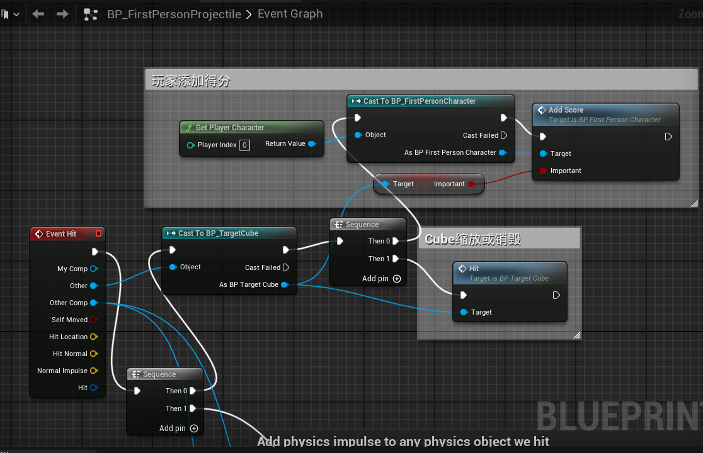
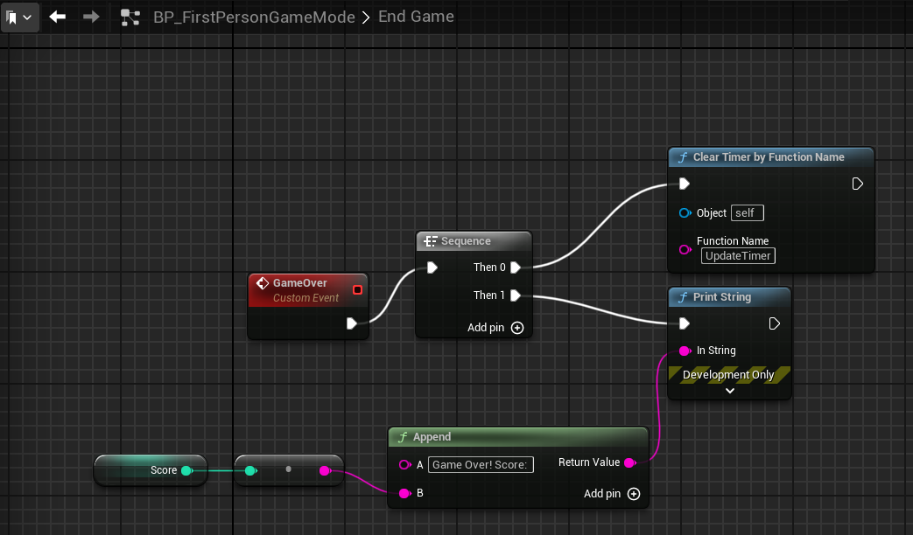

### 作业2
> 基于ue5官方的First Person模板，实现一个游戏demo，本课程作业为实现以下功能：
> 物件规则：
> 1. 射击命中方块，获得积分X分
> 2. 子弹命中方块后销毁
> 3. 方块被子弹命中后，缩放为Y倍，再次被命中后销毁  
> 游戏流程：
> 1. 游戏开始时随机N个方块成为“重要目标”，射击命中后获得双倍积分
> 2. 游戏开始后限时T秒，时间到后游戏结算，打印日志输出每个玩家获得的积分和所有玩家获得的总积分
> 
> * 附加题，Nice to have  
> 1.利用UMG制作结算UI替代日志打印  
> 2.支持多人联机

首先为在玩家蓝图中添加两个int参数: `HitScore`即击中得分X, 和`Score`用于记录玩家总分  
  
同时在玩家蓝图中编写AddScore方法, 包含一个bool参数表示是否击中重要目标, 调用函数时根据是否击中重要目标来为玩家添加`X`分数或`X*2`分数, 同时将总分数`Score`同步到GameMode的`Score`变量中. 游戏结束后由GameMode打印玩家得分.  
  
在GameMode蓝图中编写游戏UpdateTimer方法, 将设置的倒计时参数`RemainingTime`减1并打印剩余时间, 当剩余时间小于0时游戏结束.  

同时编写游戏开始事件, 每秒调用UpdateTimer方法. 然后获取所有的Cube, 打乱后根据`ImportantCount`参数来实现随机设置`N`个方块为重要方块, 同时将方块的Scale变为两倍以便观察  
  
在方块蓝图中实现`Hit`方法, 首先使用一个bool值`bHit`表示是否被击中过, 第一次击中时进行缩放, 并将`bHit`置为true, 当再次击中时将Cube销毁  
  
在炮弹蓝图中进行判定, 击中Cube后调用该Cube的`Hit`方法, 然后获取玩家调用`AddScore`方法并将该Cube的`Important`参数传入.  
  
最后游戏结束时输出玩家分数, 在GameMode添加EndGame事件来实现  
  

### 效果展示
  