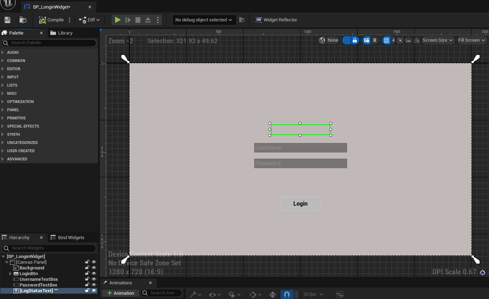
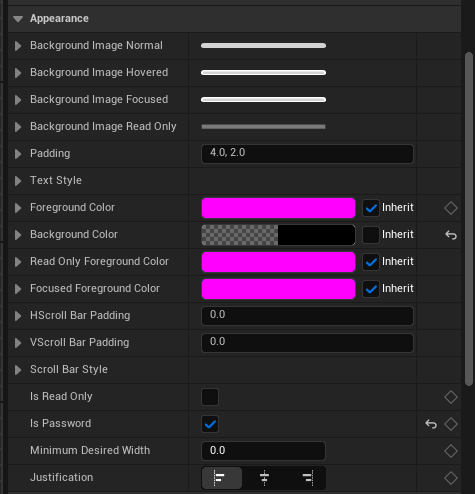
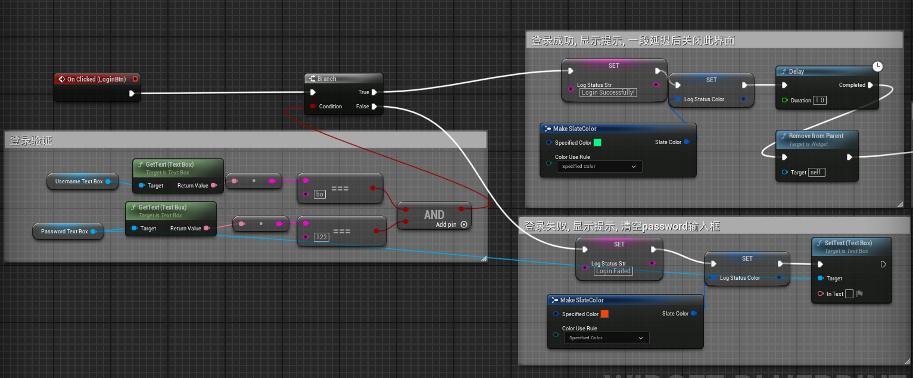
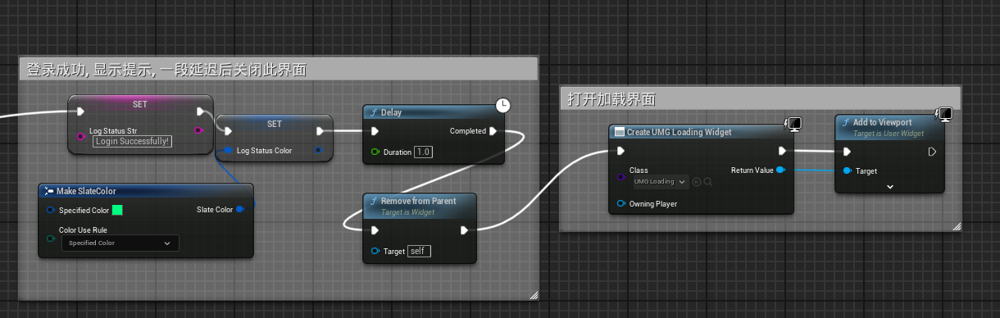
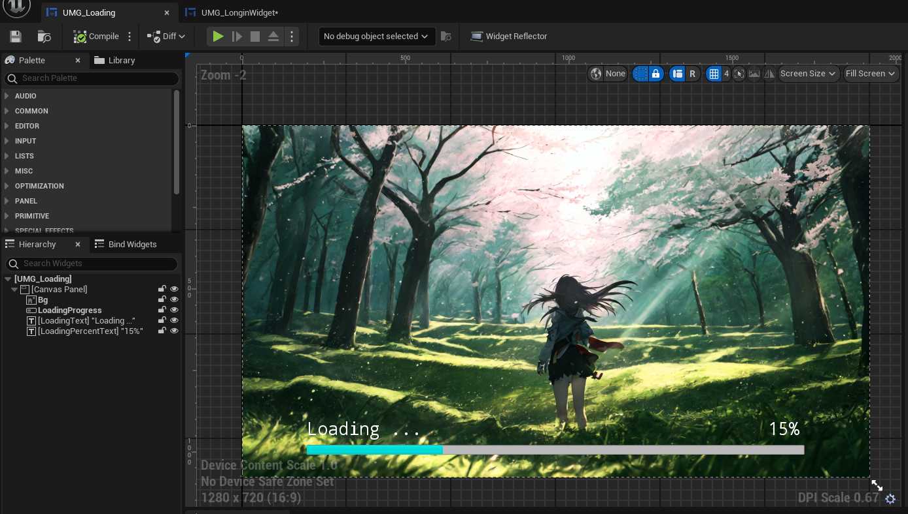
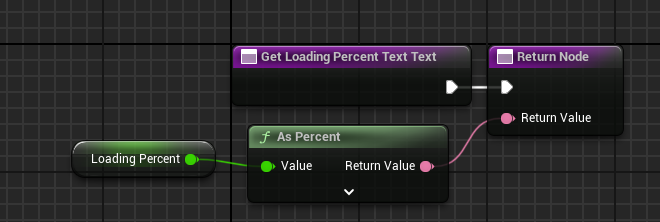
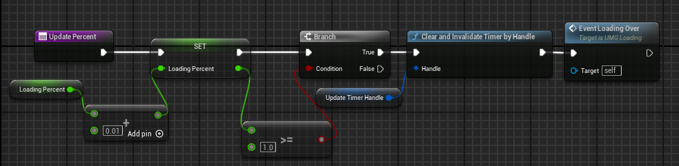
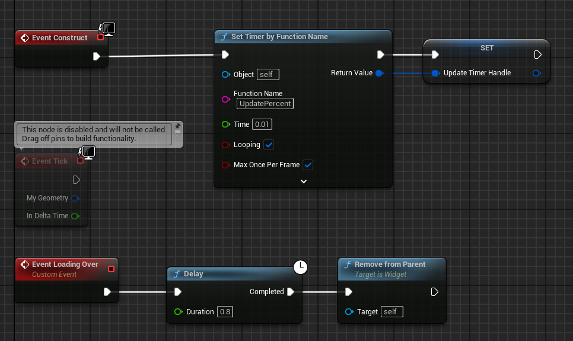

### 作业3
>1.实现登录界面（需要输入用户名和密码，其中密码加密显示，有确认按钮）  
>2.实现加载界面（要有动画表传达正在加载）  
>3.实现射击游戏操作面板（要有血条，子弹数，击中玩家会发生变化的准星  

### 登录界面  
  
包含一个背景图片, 一个用户名输入框和一个密码输入框, 一个登录按钮和一个提示信息. 要将密码加密, 只需在password的TextBox中Appearance中将`Is Password`勾选即可.   
  
由于提示信息会根据是否登录成功变化, 所以为其创建`Text`和`Color and Opacity`的绑定  
    
用户输入了用户名和密码后, 按下登录按钮进行验证, 成功后提示登录成功, 并在延迟后关闭此界面; 若失败则清空密码, 提示登录失败. 登录按钮click事件蓝图如下  
  

### 加载界面  
首先在上面的登录界面中, 登录成功关闭登录界面后打开加载界面  
  
加载界面设计如下  
  
包含一张背景图片, 一个进度条, 一个Text显示`Loading...`, 和一个显示加载百分比的Text. 进度条Percent绑定到float变量`LoadingPercent`, 同时将该变量转换为百分比字符串绑定到百分比Text.  
  
在Event Construct中启动`Set Timer by Function Name`节点, 执行更新`LoadingPercent`的函数`UpdatePercent`.  
  
每次调用增加0.01, 当值大于等于1时停止计时器, 并调用自定义事件`Event Loading OVer`, 在此事件中进行一个延迟后关闭加载界面  
  

### 射击游戏操作面板

### 效果展示
  